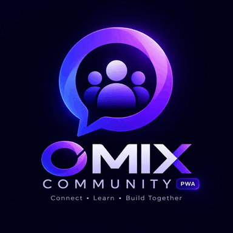

# ⚡ Omix Community

<div align="center">



**The Unified Communication & Community Ecosystem for Developers**

*Merge real-time chat intimacy with structured RFC thread permanence.*

[](https://react.dev/)
[](https://nextjs.org/)
[](https://supabase.com/)
[](https://workers.cloudflare.com/)
[](LICENSE)

</div>

---

## 🚀 Overview

**Omix Community** is a high-performance, client-only Progressive Web Application (PWA) designed specifically for developer teams, open-source maintainers, and engineering organizations.

Unlike traditional chat platforms where key architectural discussions get buried under endless scroll histories, Omix merges **high-velocity real-time chat channels** with **structured Boardroom RFC forums**, **GitHub profile integrations**, and **instant peer-to-peer WebRTC audio huddles**.

---

## ✨ Key Features

- **💬 Real-Time Developer Channels:** Instant messaging with Markdown syntax highlighting, code block snippets, message reactions, file attachments, and unread notifications powered by Supabase & Ably.
- **🏛️ Boardroom RFC Forums:** Structured, upvotable proposal threads for technical decisions, RFCs, bug reports, and announcements.
- **🐱 GitHub Profile & Repository Showcase:** OAuth GitHub integration showcasing developer bios, public repos, star/fork counts, and language breakdowns.
- **🎙️ WebRTC Voice Huddles:** Lightweight peer-to-peer audio rooms integrated directly inside channels using Jitsi WebRTC.
- **📱 Client-Only Static PWA:** Exported as static HTML/JS with zero server startup latency (`output: "export"`). Works natively on desktop and mobile devices with auto-updating Service Workers.
- **🎨 Developer Dark Design System:** Expressive Material 3 dark design tokens, JetBrains Mono code typography, glassmorphism, and responsive mobile-first layouts.

---

## 🛠️ Tech Stack

- **Frontend Framework:** React 19 + Next.js 16 (App Router)
- **Styling:** Tailwind CSS v4 + Material Design 3 Dark System Tokens
- **Icons:** Lucide React & Material Symbols
- **Database & Auth:** Supabase (PostgreSQL + RLS + Realtime)
- **Edge Microservices:** Cloudflare Workers (D1 SQLite database + Wrangler)
- **Voice/Video:** Jitsi React SDK (WebRTC)
- **Hosting Targets:** Vercel, Firebase Hosting, Netlify

---

## 📦 Getting Started

### Prerequisites

- **Node.js:** `v20.0.0` or higher
- **npm:** `v10.0.0` or higher

### Installation

1. **Clone the repository:**
   ```bash
   git clone https://github.com/omix-systems/omix-community.git
   cd omix-community
   ```

2. **Install dependencies:**
   ```bash
   npm install
   ```

3. **Start the local development server:**
   ```bash
   npm run dev
   ```
   Open [http://localhost:3000](http://localhost:3000) in your browser.

4. **Build static production export:**
   ```bash
   npm run build
   ```
   Outputs production-ready static files into the `dist/` directory.

---

## 🌐 Microservices & Cloudflare Workers

Omix utilizes Cloudflare Workers for edge API dispatch and persistent D1 SQLite archiving:

```bash
# Development server for Cloudflare Workers
npm run workers:dev

# Deploy workers to production
npm run workers:deploy

# Typecheck workers
npm run workers:typecheck
```

---

## 📚 Documentation

For in-depth operational and architectural guides, see the `docs/` folder:

- 🚀 [**Deployment Guide**](docs/DEPLOY.md) — Step-by-step instructions for Vercel, Firebase Hosting, and Supabase.
- ⚡ [**Cloudflare Workers**](docs/CLOUDFLARE_WORKERS.md) — API layer architecture and D1 database schema.
- 🛠️ [**Deployment Readiness**](docs/DEPLOYMENT_READINESS.md) — Production release checklist.
- 💰 [**Financial Specification**](finance.yaml) — Project sustainability model, infrastructure cost breakdown, and sponsorship tiers.

---

## 📄 License

This project is licensed under the [MIT License](LICENSE).
